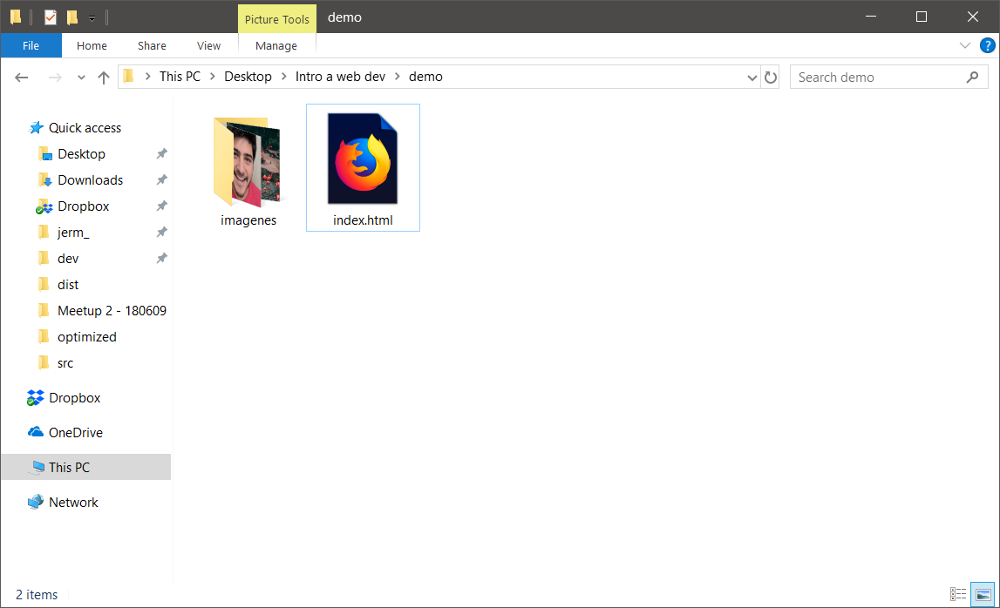
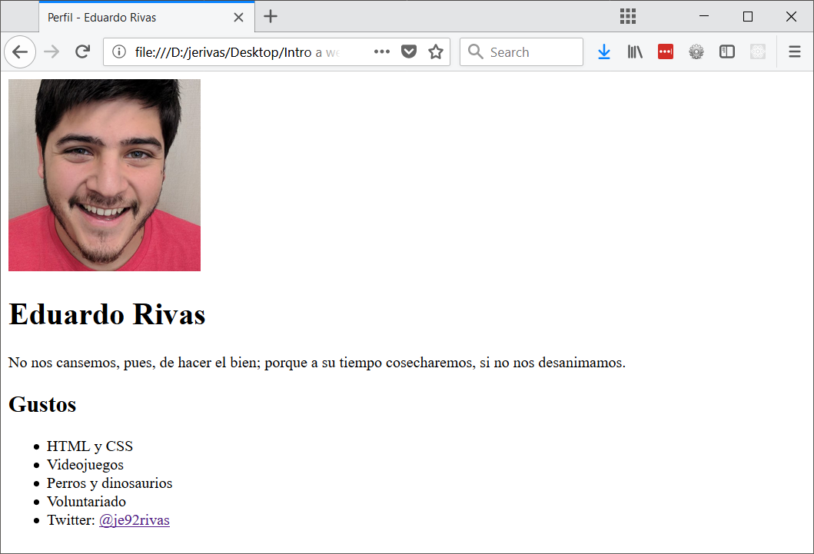
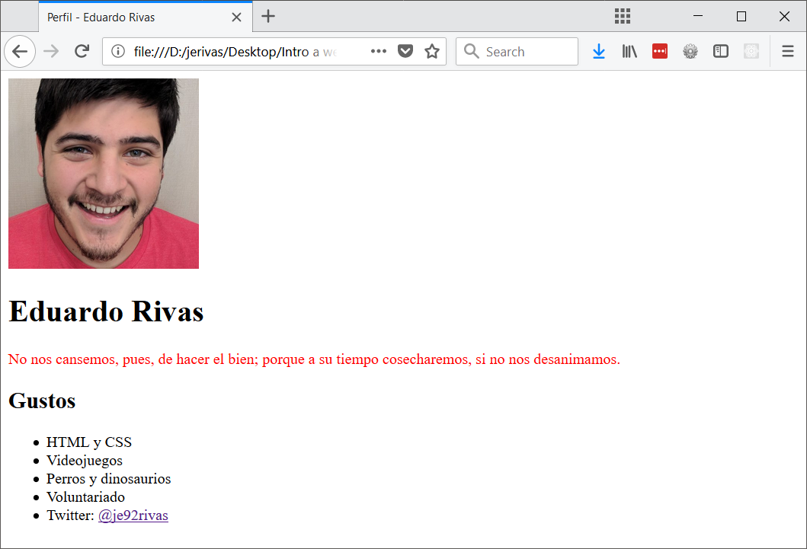
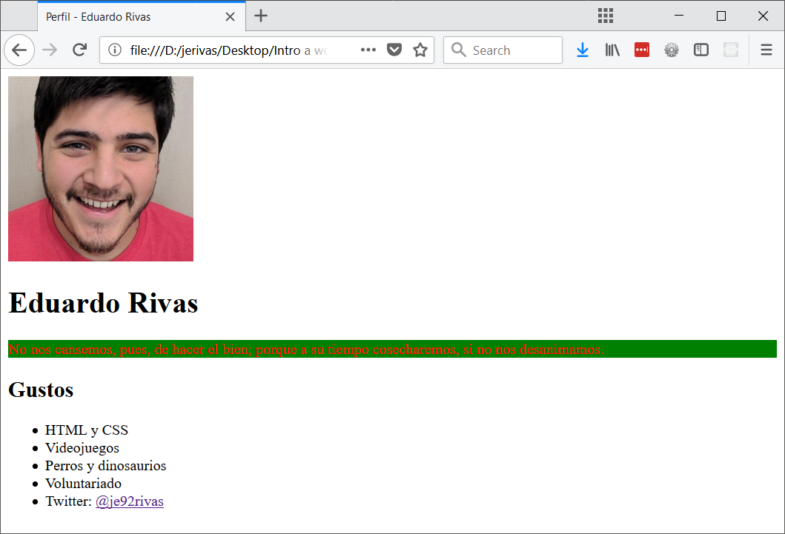
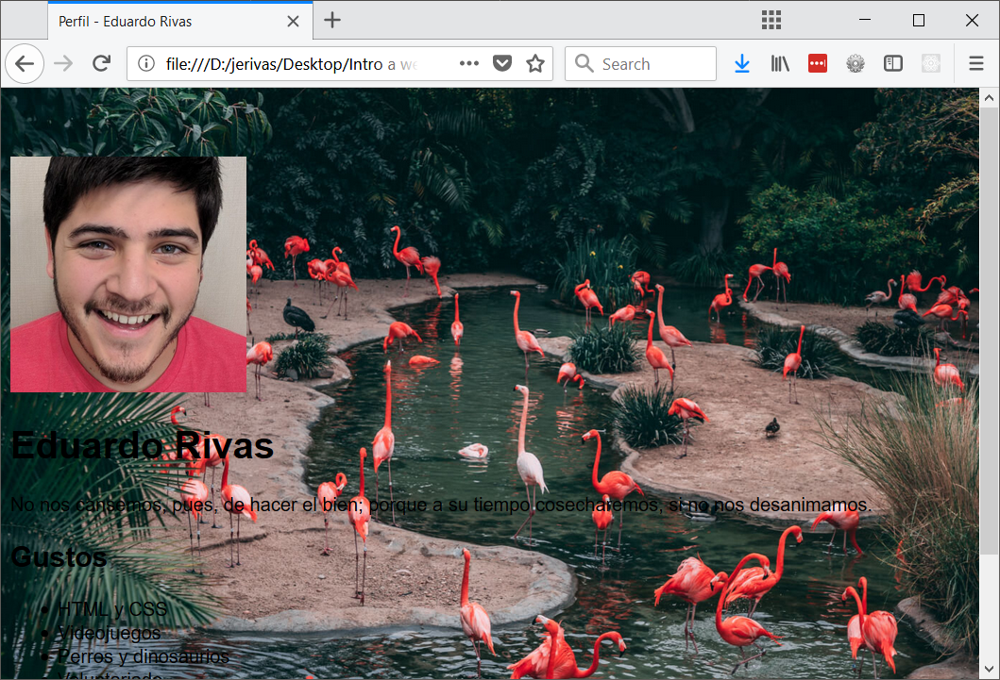
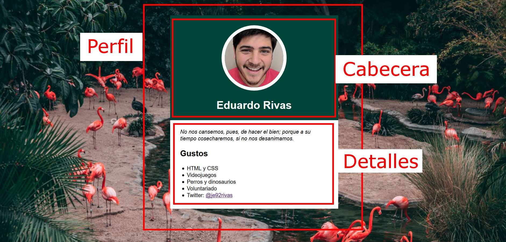
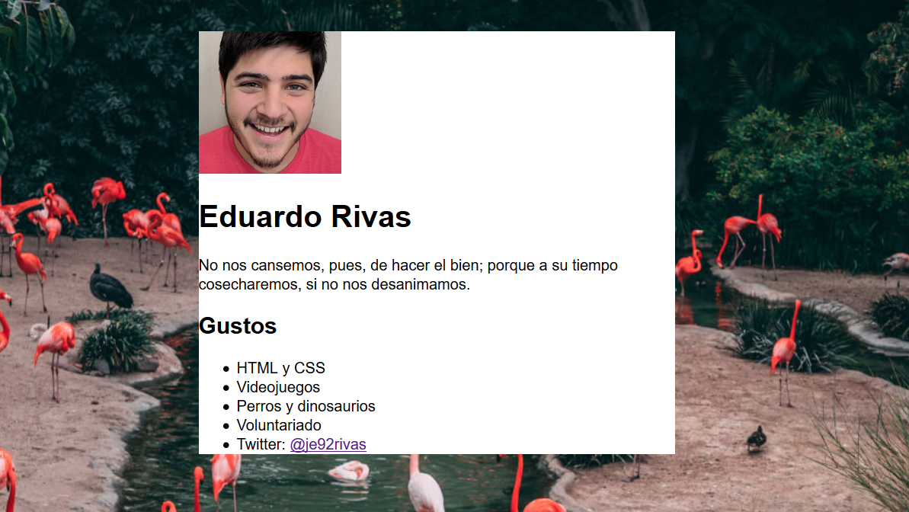
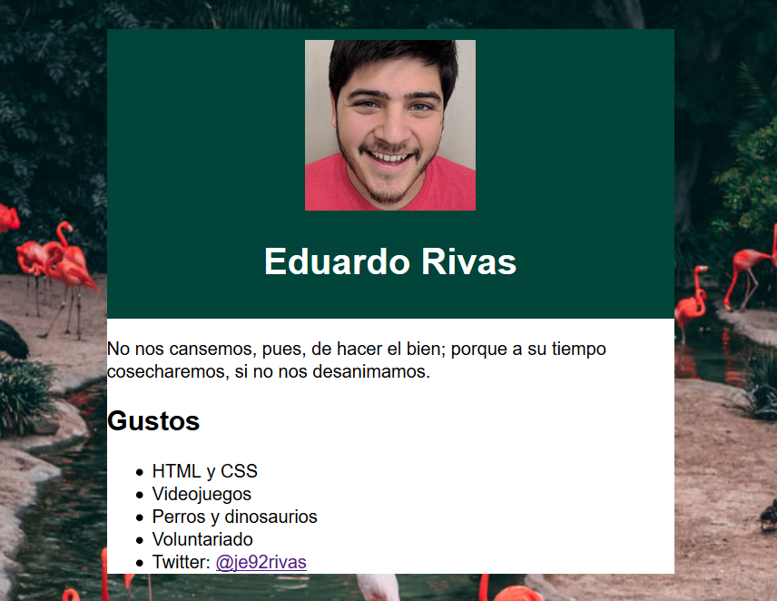

---

# Introducción ⏳

-

## Acerca de ti 🙋🏻‍♀️

- Nombre, gustos, trabajo, pasatiempos
- ¿Qué te llamó la atención de este taller?
- ¿Qué esperas haber logrado al finalizar el taller?

-

## Acerca de mí 🙋🏻‍♂️

- Desarrollo web
- Comunidades de tecnología y aprendizaje
- Unplug Studio y Unplug School
- Espero ayudarles a iniciar su travesía por el mundo de la tecnología

---

# Claves para aprender 📖

-

## Reglas de aprendizaje 📃

- No hay preguntas tontas
- La práctica hace al maestro
- Equivocarse es parte del proceso
- Tú eres el encargado de tu aprendizaje

---

# ¿Qué haremos hoy? ⚡

-

## Proyecto del día ☀

Crearás tu propia página de perfil en internet. No utilizaremos redes sociales o alguna otra herramienta existente, crearás tu página desde cero como lo hacen los profesionales.

-


-

### Preparación 😎

- Instalación de Visual Studio Code
- Foto de perfil (Croppola)
- Color favorito (W3 School: RGB Colors)
- Imagen de fondo
- Cita favorita
- Gustos y link favorito

-

### Estructura de archivos 📂

- Crea el archivo `index.html`
- Crea una carpeta junto a ese archivo, llamada `imagenes`
- Guarda tus imágenes en esa carpeta
- No utilices espacios ni caracteres especiales

-



---

# ¿Cómo funciona internet? ☁

-


-

## Clientes y servidores

- Cliente: El dispositivo que solicita el contenido
- Servidor: El dispositivo que provee el contenido

-

### Los 3 pilares de todo sitio web 🏠

- Hyper Text Markup Language (HTML): estructura y significado
- Cascading Style Sheets (CSS): visualización y experiencia de usuario
- JavaScript (JS): interactividad y comportamiento avanzado

---

# HTML 👩🏻‍💻

Hyper Text Markup Language

-

HTML no es realmente un lenguaje de programación; es un lenguaje de marcado, y es usado para decirle al navegador cómo desplegar las páginas web que visitas.

Notes:

Puede ser tan complicado o simple como el diseñador web lo desee. HTML consiste en una serie de elementos, que usas para encerrar diferentes partes del contenido para que éstos se muestren o actúen de cierta manera. Las etiquetas de encierre pueden hacer de una palabra o una imagen un hipervínculo hacia otro sitio, pueden convertir palabras en cursivas, agrandar y achicar las fuentes, y así. Por ejemplo, mira el siguiente contenido:

-

## Elementos HTML


Notes:

- La etiqueta de apertura: consiste en el nombre del elemento (en este caso, p), encerrado por paréntesis angulares (< >) de apertura y cierre. Establece dónde comienza o empieza a tener efecto el elemento — en este caso, dónde es el comienzo del párrafo.
- La etiqueta de cierre: es igual que la etiqueta de apertura, excepto que incluye una barra de cierre (/) antes del nombre de la etiqueta. Establece dónde termina el elemento — en este caso dónde termina el párrafo.
- El contenido: este es el contenido del elemento, que en este caso es sólo texto.
- El elemento: la etiqueta de apertura, más la etiqueta de cierre, más el contenido equivale al elemento.

-

## Atributos HTML


Notes:

Los atributos contienen información adicional acerca del elemento, la cual no quieres que aparezca en el contenido real del elemento. En este caso, el atributo class permite darle al elemento un nombre identificativo, que puede ser usado luego para apuntarle al elemento información de estilo y demás cosas.

Un atributo debe tener siempre:

- Un espacio entre éste y el nombre del elemento (o del atributo previo, si el elemento ya posee uno o más atributos).
- El nombre del atributo, seguido por un signo de igual (=).
- Comillas de apertura y de cierre, encerrando el valor del atributo.

-

## Elementos anidados

```html
<p>Mi gato es <strong>muy</strong> gruñon.</p>
```

Notes:

Puedes también colocar elementos dentro de otros elementos  — esto se llama anidamiento. Si, por ejemplo, queremos resaltar una palabra del texto (en nuestro ejemplo la palabra "muy"), podemos encerrarla en un elemento `<strong>`, que significa que dicha palabra debe ser enfatizada

-

El orden es importante. *Esto es incorrecto:*

```html
<p>Mi gato es <strong>muy gruñon.</p></strong>
```

Notes:

Los elementos deben abrirse y cerrarse ordenadamente, de forma tal que se encuentren claramente dentro o fuera el uno del otro. Si éstos se encuentran solapados, el navegador web tratará de adivinar lo que intentas decirle, pero puede que obtengas resultados inesperados. Así que, ¡no lo hagas!

-

## El esqueleto HTML

```html
<!DOCTYPE html>
<html>
  <head>
    <meta charset="utf-8">
    <title>Mi perfil</title>
  </head>
  <body>
    
  </body>
</html>
```

Notes:

- `<!DOCTYPE html>` — el tipo de documento. Anteriormente, cuando HTML era jóven (cerca de 1991/2), los tipos de documento actuaban como vínculos a un conjunto de reglas que el código HTML de la página debía seguir para ser considerado bueno, lo que podía significar el chequeo de errores automático y algunas otras cosas de utilidad. Sin embargo, hoy día es simplemente un artefacto antiguo que a nadie importa, pero que debe ser incluido para que todo funcione correctamente. Por ahora, eso es todo lo que necesitas saber.
- `<html></html>` — el elemento `<html>`. Este elemento encierra todo el contenido de la página entera, y a veces se le conoce como el elemento raíz (root element).
- `<head></head>` — el elemento `<head>`. Este elemento actúa como un contenedor de todo aquello que queremos incluir en la página HTML que no es contenido visible por los visitantes de la página. Incluye cosas como palabras clave, una descripción de la página que quieres que aparezca en resultados de búsquedas, CSS para dar estilo al contenido, declaraciones del juego de caracteres, etc.
- `<body></body>` — el elemento `<body>`. Encierra todo el contenido que deseas mostrar a los usuarios web que visiten tu página, ya sea texto, imágenes, videos, juegos, pistas de audio reproducibles, y demás.
- `<meta charset="utf-8">` — este elemento establece el juego de caracteres que tu documento usará en utf-8, que incluye casi todos los caracteres de todos los idiomas humanos. Básicamente, puede manejar cualquier contenido de texto que puedas incluir. No hay razón para no establecerlo, y puede evitar problemas en el futuro.
- `<title></title>` — establece el título de tu página, que es el título que aparece en la pestaña del navegador cuando la página es cargada, y se usa para describir la página cuando es añadida a los marcadores o como favorita.

-

## Imágenes

```html

```

Utiliza una `` para añadir tu foto.

Notes:

Como dijimos antes, incrusta una imagen en nuestra página, en la posición en que aparece. Lo logra a través del atributo src (source), el cual contiene el path (o ubicación) de nuestro archivo de imagen.

También incluimos un atributo alt (alternative) — el cual contiene un texto que debería describir la imagen, y que podría ser accedido por usuarios que no pueden ver la imagen

-

## Texto

-

### Encabezados

```html
<h1>Mi titulo principal</h1>
<h2>Mi titulo de nivel superior</h2>
<h3>Mi subtitulo</h3>
<h4>Mi sub-subtitulo</h4>
```

Añade tu nombre utilizando un `<h1>`.

Notes:

Los elementos de encabezado permiten especificar que ciertas partes del contenido son encabezados, o subencabezados del contenido. De la misma forma que un libro tiene un título principal, y que a su vez puede tener títulos por cada capítulo individual, y subtítulos dentro de ellos, un documento HTML puede tenerlos también. HTML posee seis niveles de encabezados, `<h1>–<h6>`, aunque probablemente sólo llegues a usar 3-4 como mucho:

-

### Párrafos

```html
<p>Este es un simple parrafo</p>
```

Añade tu cita favorita como un `<p>`.

-

### Listas numeradas

`<ol>` viene de "ordered list" y `<li>` de "list item".

```html
<ol>
  <li>Gatear</li>
  <li>Caminar</li>
  <li>Correr</li>
</ol>
```

-

### Listas no numeradas

`<ul>` viene de "unordered list".

```html
<ul>
  <li>Perros</li>
  <li>Gatos</li>
  <li>Conejos</li>
</ul>
```

Añade un `<h2>` con el texto "Mis gustos" y luego añade una `<ul>` con al menos tres `<li>` anidados.

-

### Enlaces (links)

```html
<a>Mi página favorita</a>
```

Inicia con un poco de texto y la etiqueta `<a>`.

-

```html
<a href="">Mi página favorita</a>
```

Añade el atributo `href=""`.

-

```html
<a href="http://gooogle.com">Mi página favorita</a>
```

Llena el atributo `href` con la URL.

-

## Resultado

```html
<!DOCTYPE html>
<html>
<head>
    <meta charset="UTF-8">
    <title>Perfil - Eduardo Rivas</title>
</head>

<body>
    
    <h1>Eduardo Rivas</h1>

    <p>No nos cansemos...</p>

    <h2>Gustos</h2>
    <ul>
        <li>HTML y CSS</li>
        <li>Videojuegos</li>
        <li>Perros y dinosaurios</li>
        <li>Voluntariado</li>
        <li>Twitter: <a href="http://twitter.com/je92rivas">@je92rivas</a></li>
    </ul>
</body>
</html>
```

-



Notes:

- Cambia el título de la pestaña modificando el `<title>`
- Observa como el navegador entiende que `<h1>` es más importante que `<h2>`.
- Observa que puedes hacer clic en el enlace y que el navegador te lleve a la página correcta

---

# CSS 🖌

Cascading Style Sheets

-

CSS es un *lenguaje de hojas de estilo*, es decir, te permite aplicar estilos de manera selectiva a elementos en documentos HTML.

Notes:

Si HTML provee la estructura y el significado, CSS provee el estilo y diseño. Con CSS es posible controlar la apariencia de casi cualquier parte de una página web, incluyendo la tipografía, colores, disposición y tamaño de los elementos.

-

Crea el archivo `style.css` junto a `index.html`

```css
p {
    color: red;
}
```

-

Incluye tu hoja de estilos en el `<head>` del documento

```html
<head>
    <meta charset="UTF-8">
    <title>Perfil - Eduardo Rivas</title>
    <link rel="stylesheet" href="style.css">
</head>
```

-



-

## Reglas CSS

Las hojas de estilo son una colección de reglas


Notes:

- **Selector**: El elemento HTML en el que comienza la regla. esta selecciona el(los) elemento(s) a dar estilo (en este caso, los elementos p ). Para dar estilo a un elemento diferente, solo cambia el selector.
- **Declaración**: Una sola regla como color: red; especifica a cuál de las propiedades del elemento quieres dar estilo.
- **Propiedades**: Maneras en las cuales puedes dar estilo a un elemento HTML. (En este caso, color es una propiedad del elemento p.) En CSS, seleccionas que propiedad quieres afectar en tu regla.
- **Valor de la propiedad**: A la derecha de la propiedad, después de los dos puntos (:), tenemos el valor de la propiedad, para elegir una de las muchas posibles apariencias para una propiedad determinada (hay muchos valores para color además de red).

-

Las reglas incluyen múltiples declaraciones:

```css
p {
    color: red;
    background-color: green;
}
```

Notes:

- Cada una de las reglas (aparte del selector) deben estar encapsulada entre corchetes ({}).
- Dentro de cada declaración, debes usar los dos puntos (:) para separar la propiedad de su valor.
- Dentro de cada regla, debes usar el punto y coma (;) para separar una declaración de la siguiente.

-



-

## Selectores

| Selector  | Selecciona                           |
| --------  | ------------------------------------ |
| p, li, h1 | `<p>`, `<li>` y `<h1>`               |
| #mi-id    | Único elemento con `id="mi-id"`      |
| .mi-clase | Todo elemento con `class="mi-clase"` |

Notes:

- Selector de elemento: Todos los elementos HTML del tipo especificado
- Selector de identificación (ID): El elemento en la página con el ID especificado  (en una página HTML dada, solo se permite un unico elemento por ID).
- Selector de Clase: Los elementos en la página con la clase especificada (una clase puede aparecer varias veces en una página).

-

## Estilos básicos

```css
body {
    font-family: sans-serif;
    background-image: url(imagenes/fondo.jpg);
    background-size: cover;
    padding-top: 50px;
    padding-bottom: 50px;
}
```

Notes:

Aplica las declaraciones una por una y observa su efecto.

-



-

## Conoce a las `<div>`

Las divs nos permiten agrupar elementos para poder aplicarles estilos utilizando CSS.

-



-

```html
<body>
    <div class="perfil">
        <!-- Todo lo demás -->
    </div>
</body>
```

-

```html
<div class="cabecera">
    
    <h1>Eduardo Rivas</h1>
</div>
```

-

```html
<div class="detalles">
    <p>No nos cansemos...</p>
    <h2>Mis gustos</h2>
    <ul>...</ul>
</div>
```

-

```html
<!DOCTYPE html>
<html>
<head>
  <meta charset="UTF-8">
  <title>Perfil - Eduardo Rivas</title>
  <link rel="stylesheet" href="style.css">
</head>
<body>

  <div class="perfil">
    <div class="cabecera">
      
      <h1>Eduardo Rivas</h1>
    </div>

    <div class="detalles">
      <p>No nos cansemos...</p>
      <h2>Gustos</h2>
      <ul>
        <li>HTML y CSS</li>
        <li>Videojuegos</li>
      </ul>
    </div>
  </div>

</body>
</html>
```

Notes:

Verifica que el `<body>` de tu documento se vea como lo que ves arriba. Lo importante es que tengas tres divs con las clases correctas aplicadas. El resultado en el navegador se verá idéntico, ya que las divs no producen ningún cambio hasta que se les aplican estilos.

-

Añade una nueva regla a `style.css`, guarda los cambios, y refresca tu navegador.

```css
.perfil {
    background-color: #fff;
    margin-left: auto;
    margin-right: auto;
    width: 500px;
}
```

-



-

```css
.cabecera {
    background-color: #00443A;
    padding-bottom: 10px;
    padding-top: 40px;
    text-align: center;
    color: #fff;
}
```

-



-

```css
.cabecera img {
    border-color: #fff;
    border-radius: 100%;
    border-style: solid;
    border-width: 10px;
    max-width: 35%;
}
```

Notes:

Ahora estamos utilizando el selector de clase y elemento juntos para indicar que queremos seleccionar la `` que está dentro de la div con clase "cabecera".

-


-

```css
.detalles {
    padding-top: 10px;
    padding-bottom: 10px;
    padding-left: 30px;
    padding-right: 30px;
}
```

-


-

```css
.detalles ul {
    padding-left: 20px;
}
```

-


Notes:

Prueba con estas propiedas:

- font-size: 50px
- font-style: italic
- line-height: 2
- text-shadow: 0 0 50px black
- box-shadow: 0 0 50px black

-

## 🎉 ¡Misión cumplida! 🎉

Has creado tu primera página web

Notes:

Si hay tiempo, compartir instrucciones para enviar y subir el trabajo realizado.

---

# Repaso 🔃

-

## Internet ☁

- Una red de computadoras
- Clientes y servidores
- Utiliza HTML, CSS, y JavaScript

-

## HTML 👩🏻‍💻

- Lenguaje de marcado
- Provee estructura y contenido
- Compuesto por etiquetas
- Las etiquetas pueden anidarse
- Las etiquetas aceptan atributos

-

```html
<div class="cabecera">
    
    <h1>Eduardo Rivas</h1>
</div>
```

-

## CSS 🖌

- Lenguaje de hoja de estilos
- Define el estilo y apariencia
- Compuesto por reglas
- Las reglas contienen selectores y declaraciones

-

```css
.cabecera img {
    border-color: #fff;
    border-radius: 100%;
    border-style: solid;
    border-width: 10px;
    max-width: 35%;
}
```

-

## ¿Preguntas? 🤔

---

# Siguientes pasos 🚀

-

- La práctica hace al maestro
- Eres el responsable de tu aprendizaje
- Utiliza los recursos que recibiste
- Queremos saber tu opinión
