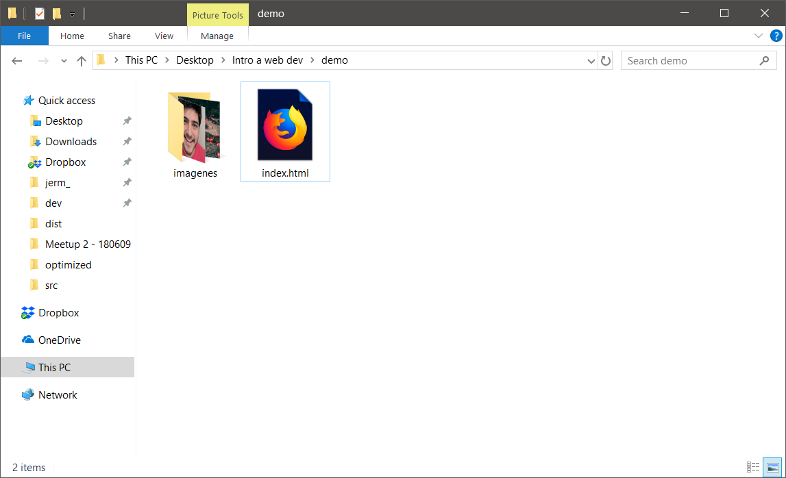
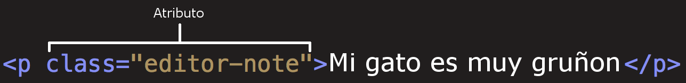

# Unplug School

===

# Introducción

---

## Acerca de ti

- Nombre, gustos, trabajo, pasatiempos
- ¿Qué te llamó la atención de este taller?
- ¿Qué esperas haber logrado al finalizar el taller?

---

## Acerca de mí

- Desarrollo web
- Comunidades de tecnología y aprendizaje
- Unplug Studio y Unplug School
- Espero ayudarles a iniciar su travesía por el mundo de la tecnología

===

# Claves para aprender

---

## Reglas de aprendizaje

- No hay preguntas tontas
- La práctica hace al maestro
- Equivocarse es parte del proceso
- Tú eres el encargado de tu aprendizaje

===

# ¿Qué haremos hoy?

---

## Proyecto del día

Crearás tu propia página de perfil en internet. No utilizaremos redes sociales o alguna otra herramienta existente, crearás tu página desde cero como lo hacen los profesionales.

---


---

### Preparación

- Instalación de Visual Studio Code
- Foto de perfil (Croppola)
- Color favorito (W3 School: RGB Colors)
- Imagen de fondo
- Cita favorita
- Gustos y link favorito

---

### Estructura de archivos

- Crea el archivo `index.html`
- Crea una carpeta junto a ese archivo, llamada `imagenes`
- Guarda tus imágenes en esa carpeta
- No utilices espacios ni caracteres especiales

---



===

# ¿Cómo funciona internet?

---


---

## Clientes y servidores

- Cliente: El dispositivo que solicita el contenido
- Servidor: El dispositivo que provee el contenido

---

### Los tres pilares de todo sitio web

- Hyper Text Markup Language (HTML): estructura y significado
- Cascading Style Sheets (CSS): visualización y experiencia de usuario
- JavaScript (JS): interactividad y comportamiento avanzado

===

# HTML

Hyper Text Markup Language

---

HTML no es realmente un lenguaje de programación; es un lenguaje de marcado, y es usado para decirle al navegador cómo desplegar las páginas web que visitas.

Notes:

Puede ser tan complicado o simple como el diseñador web lo desee. HTML consiste en una serie de elementos, que usas para encerrar diferentes partes del contenido para que éstos se muestren o actúen de cierta manera. Las etiquetas de encierre pueden hacer de una palabra o una imagen un hipervínculo hacia otro sitio, pueden convertir palabras en cursivas, agrandar y achicar las fuentes, y así. Por ejemplo, mira el siguiente contenido:

---

## Elementos HTML


Notes:

- La etiqueta de apertura: consiste en el nombre del elemento (en este caso, p), encerrado por paréntesis angulares (< >) de apertura y cierre. Establece dónde comienza o empieza a tener efecto el elemento — en este caso, dónde es el comienzo del párrafo.
- La etiqueta de cierre: es igual que la etiqueta de apertura, excepto que incluye una barra de cierre (/) antes del nombre de la etiqueta. Establece dónde termina el elemento — en este caso dónde termina el párrafo.
- El contenido: este es el contenido del elemento, que en este caso es sólo texto.
- El elemento: la etiqueta de apertura, más la etiqueta de cierre, más el contenido equivale al elemento.

---

## Atributos HTML



Notes:

Los atributos contienen información adicional acerca del elemento, la cual no quieres que aparezca en el contenido real del elemento. En este caso, el atributo class permite darle al elemento un nombre identificativo, que puede ser usado luego para apuntarle al elemento información de estilo y demás cosas.

Un atributo debe tener siempre:

- Un espacio entre éste y el nombre del elemento (o del atributo previo, si el elemento ya posee uno o más atributos).
- El nombre del atributo, seguido por un signo de igual (=).
- Comillas de apertura y de cierre, encerrando el valor del atributo.

---

## Elementos anidados

```html
<p>Mi gato es <strong>muy</strong> gruñon.</p>
```

Notes:

Puedes también colocar elementos dentro de otros elementos  — esto se llama anidamiento. Si, por ejemplo, queremos resaltar una palabra del texto (en nuestro ejemplo la palabra "muy"), podemos encerrarla en un elemento `<strong>`, que significa que dicha palabra debe ser enfatizada

---

## Elementos anidados

El orden es importante. *Esto es incorrecto:*

```html
<p>Mi gato es <strong>muy gruñon.</p></strong>
```

Notes:

Los elementos deben abrirse y cerrarse ordenadamente, de forma tal que se encuentren claramente dentro o fuera el uno del otro. Si éstos se encuentran solapados, el navegador web tratará de adivinar lo que intentas decirle, pero puede que obtengas resultados inesperados. Así que, ¡no lo hagas!

---

## El esqueleto HTML

---

```html
<!DOCTYPE html>
<html>
  <head>
    <meta charset="utf-8">
    <title>Mi perfil</title>
  </head>
  <body>
    
  </body>
</html>
```

Notes:

- `<!DOCTYPE html>` — el tipo de documento. Anteriormente, cuando HTML era jóven (cerca de 1991/2), los tipos de documento actuaban como vínculos a un conjunto de reglas que el código HTML de la página debía seguir para ser considerado bueno, lo que podía significar el chequeo de errores automático y algunas otras cosas de utilidad. Sin embargo, hoy día es simplemente un artefacto antiguo que a nadie importa, pero que debe ser incluido para que todo funcione correctamente. Por ahora, eso es todo lo que necesitas saber.
- `<html></html>` — el elemento `<html>`. Este elemento encierra todo el contenido de la página entera, y a veces se le conoce como el elemento raíz (root element).
- `<head></head>` — el elemento `<head>`. Este elemento actúa como un contenedor de todo aquello que queremos incluir en la página HTML que no es contenido visible por los visitantes de la página. Incluye cosas como palabras clave, una descripción de la página que quieres que aparezca en resultados de búsquedas, CSS para dar estilo al contenido, declaraciones del juego de caracteres, etc.
- `<body></body>` — el elemento `<body>`. Encierra todo el contenido que deseas mostrar a los usuarios web que visiten tu página, ya sea texto, imágenes, videos, juegos, pistas de audio reproducibles, y demás.
- `<meta charset="utf-8">` — este elemento establece el juego de caracteres que tu documento usará en utf-8, que incluye casi todos los caracteres de todos los idiomas humanos. Básicamente, puede manejar cualquier contenido de texto que puedas incluir. No hay razón para no establecerlo, y puede evitar problemas en el futuro.
- `<title></title>` — establece el título de tu página, que es el título que aparece en la pestaña del navegador cuando la página es cargada, y se usa para describir la página cuando es añadida a los marcadores o como favorita.
